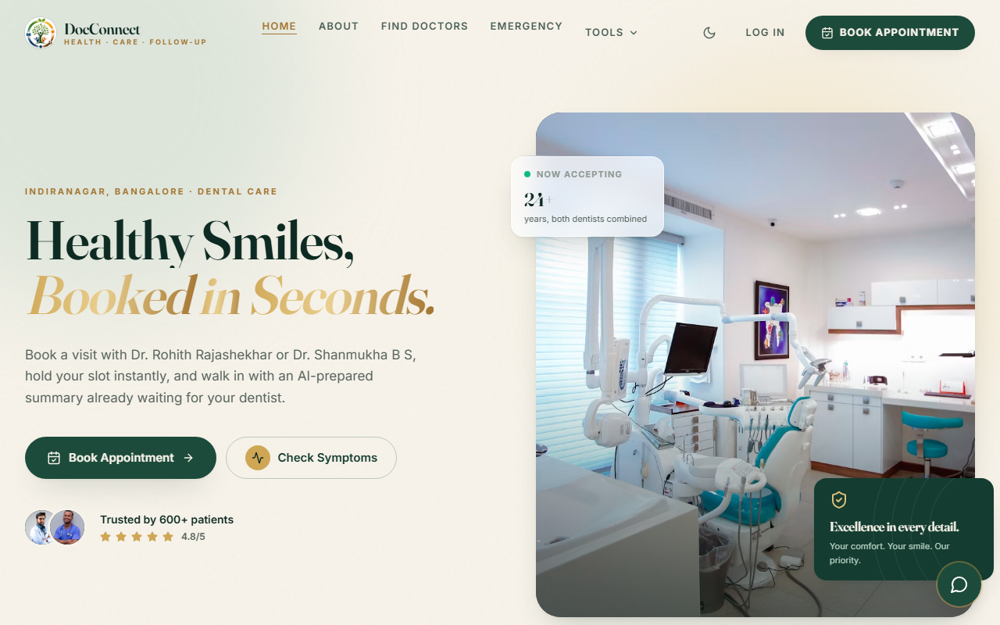
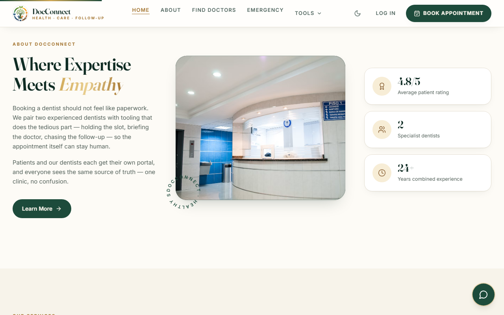
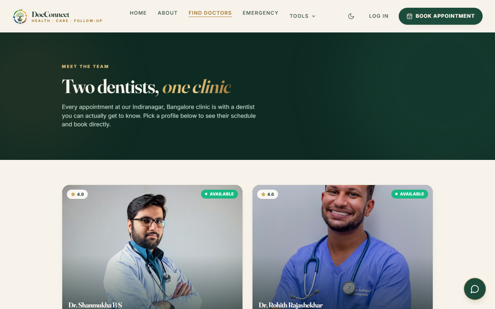
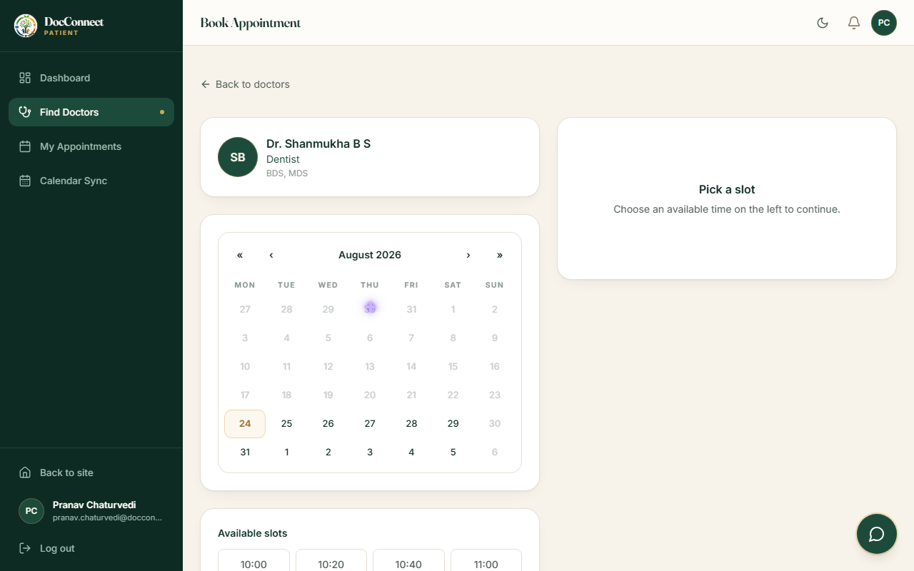
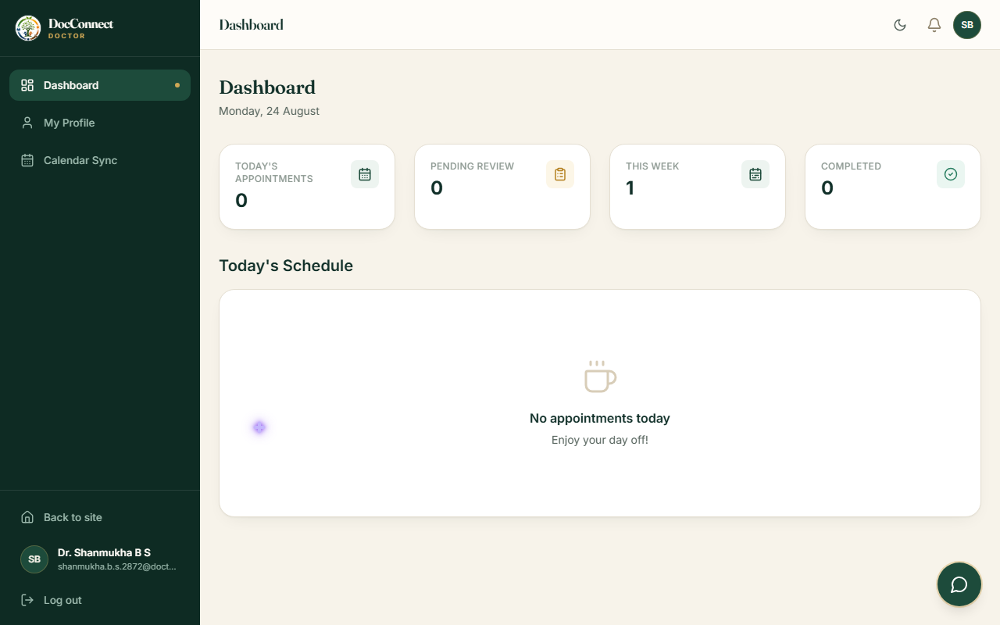
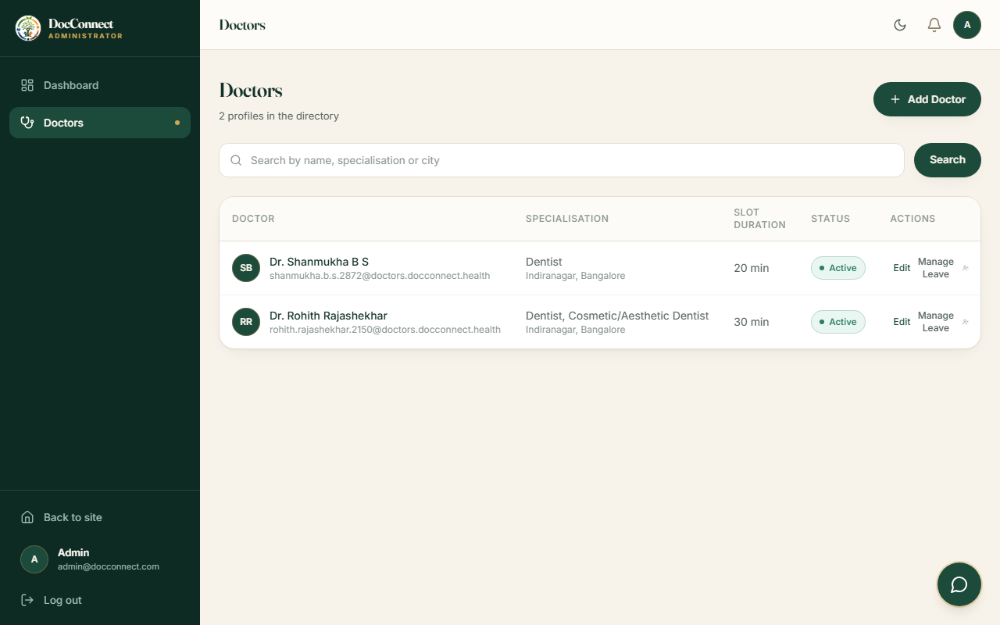
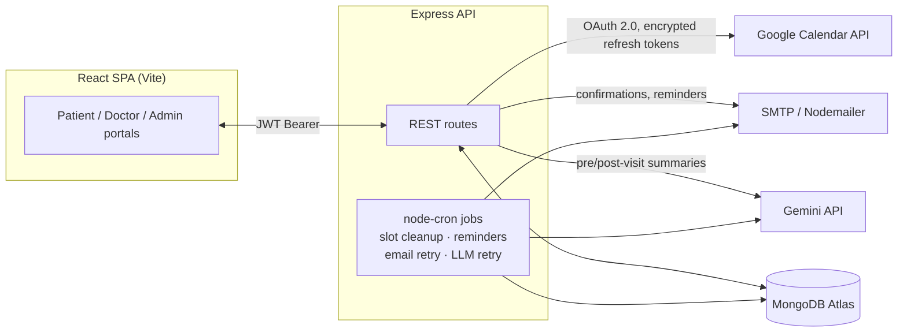

<div align="center">

# 🦷 DocConnect

### Healthcare Appointment & Follow-up Manager

*A full-stack booking platform with AI-assisted triage, atomic slot-holding, automated email, and Google Calendar sync — built for a real two-dentist clinic.*

[](https://nodejs.org)
[](https://react.dev)
[](https://expressjs.com)
[](https://www.mongodb.com)
[](https://vitejs.dev)
[](https://tailwindcss.com)
[](https://ai.google.dev)

[Features](#features) · [Screenshots](#screenshots) · [Architecture](#architecture) · [Getting started](#getting-started) · [API docs](#api-documentation) · [System design](SYSTEM_DESIGN.md)

</div>

---

## Overview

DocConnect is a role-based appointment platform for a dental clinic: **patients** book a slot and describe their symptoms, **dentists** walk into each visit already briefed by an AI-generated triage summary, and an **admin** manages the roster, schedules, and leave days — all backed by the same source of truth. Booking confirmations, reminders, and post-visit summaries go out over email; confirmed appointments sync to both parties' Google Calendars.

This was built against a specific assignment brief (linked in [`SYSTEM_DESIGN.md`](SYSTEM_DESIGN.md)) that graded on four things in particular: **double-booking prevention under concurrent requests**, **doctor leave-day conflict handling**, **the slot-hold mechanism**, and **notification failure handling** — each has its own writeup there, with the actual atomic Mongo query used.

## Features

- 🔍 **Book without phone tag** — patients pick a dentist, hold a real slot instantly (a live 5-minute reservation, not a soft UI state), describe symptoms, and confirm.
- 🤖 **AI pre-visit triage** — symptoms are turned into an urgency level (Low/Medium/High), a one-line chief complaint, and three questions worth asking, via the Gemini API. Delivered to the dentist's dashboard before the visit starts.
- 📝 **AI post-visit summaries** — a dentist's clinical shorthand and prescription become a plain-language explanation and medication schedule, emailed to the patient automatically.
- 🔒 **Zero double-bookings, even under a race** — verified directly: two simultaneous hold requests for the same slot return exactly one `200` and one `409`, enforced by MongoDB's own partial unique index, no application-level locking.
- 🏖️ **Leave days that don't leave patients stranded** — marking a dentist on leave cascades: every affected confirmed appointment is cancelled, the patient is emailed, and both Google Calendar events are deleted — automatically, in one admin action.
- 📅 **Google Calendar sync** — OAuth 2.0 per user, refresh tokens encrypted at rest (AES-256-GCM), calendar events created/updated/deleted alongside every booking change. Never blocks the booking itself if it fails.
- ✉️ **Email that actually retries** — every send is logged as a `Notification` row; failures retry on an exponential backoff schedule via a cron job, not silently dropped.
- 💊 **Medication reminders** — a background job parses prescription frequency and schedules reminder emails automatically.
- 🌗 **Light/dark, fully responsive** — three portal shells (marketing site, patient/doctor sidebar, admin) built with Tailwind and Framer Motion.
- ✅ **A built-in integration checker** — `node scripts/checkIntegrations.js` smoke-tests your Gemini key, SMTP credentials, and Google OAuth client against the live APIs before you ever click through the UI. See [Verifying your setup](#verifying-your-setup).

## Screenshots

<table>
<tr>
<td width="50%">

**Landing page**


</td>
<td width="50%">

**Services & clinic stats**


</td>
</tr>
<tr>
<td width="50%">

**Find a dentist**


</td>
<td width="50%">

**Booking flow — live slots**


</td>
</tr>
<tr>
<td width="50%">

**Doctor dashboard**


</td>
<td width="50%">

**Admin — doctor roster**


</td>
</tr>
</table>

## Architecture



Every external call (Gemini, SMTP, Google Calendar) is wrapped so its failure never blocks the booking/cancellation/completion operation that triggered it — see [Notification failure handling](SYSTEM_DESIGN.md#notification-failure-handling) for the exact retry mechanics.

## Tech stack

| Layer | Technology |
|---|---|
| Frontend | React 18, Vite, React Router v7, Tailwind CSS, Framer Motion |
| Backend | Node.js, Express |
| Database | MongoDB + Mongoose |
| Auth | JWT + bcrypt, role-based (`patient` / `doctor` / `admin`) |
| AI | Google Gemini API (`@google/generative-ai`) |
| Email | Nodemailer (any SMTP provider) |
| Calendar | Google Calendar API (OAuth 2.0, `googleapis`) |
| Background jobs | node-cron |

## Project structure

```
docconnect/
├── client/                React frontend (Vite)
│   └── src/
│       ├── components/    Shared UI — Navbar, Toast, ui/ primitives, booking widgets…
│       ├── pages/         Route pages, organized by role: patient/, doctor/, admin/
│       ├── home/          Landing page sections
│       ├── context/       AuthContext (JWT session)
│       ├── services/      Thin axios wrappers per API domain
│       └── clinicInfo.js  Single source of truth for clinic name/address/stats
├── server/                Express API
│   ├── data/               doctors.jsonl — practitioner dataset (17,636 rows, JSON Lines)
│   ├── scripts/             importDoctors.js, trimToClinic.js, checkIntegrations.js
│   ├── models/               User, DoctorProfile, Appointment, Notification
│   ├── controllers/ / routes/  Route handlers by domain
│   ├── middleware/             auth.js (JWT verify), roleGuard.js, errorHandler.js
│   ├── services/                llm.js, email.js, calendar.js, slots.js, crypto.js
│   ├── jobs/                     node-cron background jobs
│   ├── templates/                 Inline-styled HTML email templates
│   └── seed.js                     Admin account seeder
├── docs/screenshots/
├── .env.example
├── README.md
└── SYSTEM_DESIGN.md        Double-booking, leave conflicts, slot holds, notification retries
```

## Getting started

### Prerequisites

- Node.js 18+
- A MongoDB instance — Atlas (free tier is fine) or local (`docker run -d -p 27017:27017 --name docconnect-mongo mongo:7`)
- *(Optional, for full functionality)* A Gemini API key, an SMTP account, and a Google Cloud OAuth client — the app and core booking flow work without these; AI summaries and emails just log a graceful failure and retry in the background. See [Verifying your setup](#verifying-your-setup).

### 1. Clone and install

```bash
git clone <this-repo-url> docconnect
cd docconnect
npm run install:all   # installs both server/ and client/ dependencies
```

### 2. Configure environment variables

```bash
cp .env.example server/.env
cp client/.env.example client/.env
```

Edit `server/.env` — at minimum `MONGODB_URI`, `JWT_SECRET`, `ENCRYPTION_KEY`, `ADMIN_EMAIL`, `ADMIN_PASSWORD`. Add `GEMINI_API_KEY`, `SMTP_*`, and `GOOGLE_*` when ready — see [.env.example](.env.example) for every variable.

`client/.env` just needs `VITE_API_URL` (defaults to `http://localhost:5000/api`).

### 3. Seed the admin account

```bash
npm run seed
```

Creates (or promotes) the admin user from `ADMIN_EMAIL` / `ADMIN_PASSWORD`. Log in to reach `/admin/dashboard` and manage doctors.

### 4. The two doctors already in the database

This deployment is configured for a single dental clinic with two dentists:

| Doctor | Speciality | Experience |
|---|---|---|
| Dr. Rohith Rajashekhar | Dentist, Cosmetic/Aesthetic Dentist | 6 years |
| Dr. Shanmukha B S | Dentist | 18 years |

Both were picked from the dataset below and share one clinic address. Their login emails end in `@doctors.docconnect.health`; the password is in `DATASET_DOCTOR_PASSWORD` (default `Doctor@123`).

### 5. Run the app

```bash
npm run dev   # runs server (port 5000) and client (port 5173) together
```

Visit `http://localhost:5173`. Register a patient account at `/register`, or log in as one of the two seeded dentists / the admin above.

### Testing the core flow

1. Log in as admin → **Doctors** → set working hours / slot duration from a doctor's edit page.
2. Log in (or register) as a patient → **Find Doctors** → pick a dentist → pick a date and slot (this places a 5-minute hold) → describe symptoms → confirm.
3. Watch the server terminal — the pre-visit LLM call and booking-confirmation email are both attempted (and log gracefully if not configured).
4. Log in as the dentist → **Dashboard** → open the appointment → see the symptoms and AI summary → **Complete Visit** with notes and a prescription.
5. Back as the patient → **My Appointments** → open the completed appointment → see the post-visit summary and prescription.

## Verifying your setup

Rather than discovering a bad API key mid-booking, run:

```bash
cd server
node scripts/checkIntegrations.js
```

It round-trips real requests against Gemini, SMTP, and Google's OAuth token endpoint (without needing a full browser-based consent flow), and checks `JWT_SECRET`/`ENCRYPTION_KEY` aren't left as dev placeholders. Anything left blank in `.env` is reported `SKIP`, not `FAIL`. Add `--email you@example.com` to also send a real test email through your configured SMTP account.

```
[PASS] Secrets — JWT_SECRET and ENCRYPTION_KEY look strong
[PASS] Gemini — gemini-3.6-flash → urgency "Medium", 3 questions
[SKIP] SMTP — SMTP_HOST/SMTP_USER are empty
[SKIP] Google Calendar — GOOGLE_CLIENT_ID/SECRET are empty

2 passed, 0 failed, 2 skipped.
```

### Setting up Gemini

1. Go to [aistudio.google.com/app/apikey](https://aistudio.google.com/app/apikey) and sign in.
2. **Create API key → Create API key in new project.**
3. Copy the key into `server/.env` as `GEMINI_API_KEY`.

Google periodically retires model ids; if `checkIntegrations.js` reports a 404, its error message names the current replacement — update `GEMINI_MODEL` to match.

### Setting up email (Gmail example)

1. Turn on 2-Step Verification at [myaccount.google.com/security](https://myaccount.google.com/security), if not already on.
2. Go to [myaccount.google.com/apppasswords](https://myaccount.google.com/apppasswords), name the app, **Create**.
3. Copy the 16-character password into `server/.env`:
   ```
   SMTP_HOST=smtp.gmail.com
   SMTP_PORT=587
   SMTP_USER=youraddress@gmail.com
   SMTP_PASS=<16-character app password>
   ```

### Setting up Google Calendar

1. Go to the [Google Cloud Console](https://console.cloud.google.com/) → create a new project.
2. **APIs & Services → Library** → search "Google Calendar API" → **Enable**.
3. **APIs & Services → OAuth consent screen** → **External** → fill in app name / support email → add your account as a test user (the app is unverified).
4. **APIs & Services → Credentials → Create Credentials → OAuth client ID** → **Web application**.
   - Authorized redirect URI: `http://localhost:5000/api/calendar/callback` (must exactly match `GOOGLE_REDIRECT_URI`).
5. Copy the **Client ID** and **Client secret** into `server/.env`.
6. In the app, visit `/patient/calendar-connect` or `/doctor/calendar-connect` → **Connect Google Calendar** → complete Google's consent screen.

If calendar sync fails for any reason (not connected, expired token, API error), the appointment operation itself still succeeds — the failure is logged, never blocking.

## Scaling beyond one clinic

The repo ships with `server/data/doctors.jsonl` — 17,636 real practitioner records across India (name, degree, speciality, city, locality, fee, experience, rating) — in case this ever grows from one clinic into a multi-doctor directory.

```bash
cd server
npm run import:doctors                      # import all 17,636 rows (~2 minutes)
node scripts/importDoctors.js --limit 500    # or just a sample
node scripts/importDoctors.js --fresh        # wipe previously imported rows first
node scripts/normaliseSpecialities.js        # repair run-together labels from older imports
```

Re-running is safe — rows already present (matched on generated email) are skipped. This brings back a large multi-city directory; the landing page copy, `/doctors` page, and `client/src/clinicInfo.js` were written for the two-doctor clinic and would need revisiting first. `server/scripts/trimToClinic.js` is the reverse operation.

## API documentation

All routes are mounted under `/api`. Protected routes require `Authorization: Bearer <token>`.

### Auth (`/api/auth`)

| Method | Path | Auth | Request | Response |
|---|---|---|---|---|
| POST | `/register` | Public | `{ name, email, password, phone? }` | `201` `{ token, user }` — always `role: 'patient'` |
| POST | `/login` | Public | `{ email, password }` | `200` `{ token, user }` |
| GET | `/me` | Any role | — | `200` current user profile |

### Doctors — public browse (`/api/doctors`)

| Method | Path | Auth | Request | Response |
|---|---|---|---|---|
| GET | `/` | Public | query: `specialisation?`, `city?`, `search?`, `minFee?`, `maxFee?`, `minExperience?`, `sort?`, `page?`, `limit?` | `200` `{ doctors: [...], page, limit, total, totalPages }` |
| GET | `/facets` | Public | — | `200` `{ cities, specialities, stats: { totalDoctors, totalCities, avgRating, maxFee } }` |
| GET | `/:id` | Public | — | `200` `DoctorProfile` or `404` |
| GET | `/:id/slots` | Public | query: `date=YYYY-MM-DD` | `200` `{ date, slotDuration, slots: ["09:00", ...] }` |

`sort` accepts `rating` (default), `experience`, `fee_asc`, `fee_desc`. `limit` is capped at 60.

### Appointments — patient portal (`/api/appointments`, role: `patient`)

| Method | Path | Request | Response |
|---|---|---|---|
| POST | `/hold` | `{ doctorId, date, startTime }` | `200` `{ appointmentId, heldUntil }` or `409` if the slot is taken |
| POST | `/confirm` | `{ appointmentId, symptoms }` | `200` confirmed `Appointment`, or `410` if the hold expired |
| GET | `/my` | — | `200` array of the patient's appointments |
| PUT | `/:id/cancel` | — | `200` cancelled `Appointment` |
| PUT | `/:id/reschedule` | `{ date, startTime }` | `200` new confirmed `Appointment` (old one marked `rescheduled`) |

### Doctor portal (`/api/doctor`, role: `doctor`)

| Method | Path | Request | Response |
|---|---|---|---|
| GET | `/appointments` | — | `200` the doctor's appointments |
| GET | `/appointments/:id` | — | `200` single appointment with patient details |
| PUT | `/appointments/:id/complete` | `{ notes, prescription: [{medication, dosage, frequency, duration, instructions}] }` | `200` completed `Appointment` with generated `postVisitSummary` |
| GET | `/profile` | — | `200` own `DoctorProfile` |
| PUT | `/profile` | `{ bio?, qualifications?, profileImage? }` | `200` updated `DoctorProfile` |

### Admin portal (`/api/admin`, role: `admin`)

| Method | Path | Request | Response |
|---|---|---|---|
| GET | `/doctors` | query: `search?`, `page?`, `limit?` | `200` `{ doctors, page, limit, total, totalPages }` |
| POST | `/doctors` | `{ name, email, password, phone?, specialisation, qualifications?, bio?, slotDuration?, workingHours? }` | `201` `{ user, profile }` |
| PUT | `/doctors/:id` | any subset of profile fields incl. `workingHours`, `isActive` | `200` updated `DoctorProfile` |
| DELETE | `/doctors/:id` | — | `200` — soft delete, sets `isActive: false` |
| PUT | `/doctors/:id/leave` | `{ date }` or `{ dates: [...] }` | `200` `{ doctor, cancelledAppointments }` |

### Calendar (`/api/calendar`)

| Method | Path | Auth | Response |
|---|---|---|---|
| GET | `/auth-url` | Any role | `200` `{ url }` — Google OAuth consent URL |
| GET | `/callback` | Public (Google redirects here) | `302` redirect back to the frontend with `?connected=1|0` |

### Notifications (`/api/notifications`)

| Method | Path | Auth | Response |
|---|---|---|---|
| GET | `/my` | Any role | `200` the current user's last 50 notification log entries |

## Database schema

**User**
```
name: String
email: String (unique)
passwordHash: String
role: 'patient' | 'doctor' | 'admin'
phone: String
googleCalendarRefreshToken: String (encrypted, select:false)
googleCalendarConnected: Boolean
createdAt: Date
```

**DoctorProfile**
```
userId: ObjectId → User
specialisation: String            display label, e.g. "Cardiologist, Interventional Cardiologist"
specialities: [String]            individually searchable tags split out of the above
qualifications: String
workingHours: [{ day, startTime, endTime }]
slotDuration: Number (minutes, default 30)
leaveDays: [Date]
bio: String
profileImage: String
isActive: Boolean
city: String                      indexed — directory filter
locality: String
consultationFee: Number           indexed — ₹, directory filter
experienceYears: Number           indexed — directory filter
rating: Number                    0–5
reviewCount: Number
source: 'manual' | 'dataset'
```
Indexes: text index on `specialisation/qualifications/city/locality`; compound `{isActive, rating, experienceYears}` backing the default directory sort.

**Appointment**
```
patientId: ObjectId → User
doctorId: ObjectId → DoctorProfile
date: Date
startTime, endTime: String ("HH:MM")
status: 'pending' | 'confirmed' | 'completed' | 'cancelled' | 'rescheduled'
symptoms: String
preVisitSummary: { urgencyLevel, chiefComplaint, suggestedQuestions[], generatedAt, llmFailed, llmError, llmRetryCount }
postVisitSummary: { patientFriendlySummary, medicationSchedule, followUpSteps, generatedAt, llmFailed, llmError, llmRetryCount }
doctorNotes: String
prescription: [{ medication, dosage, frequency, duration, instructions }]
googleCalendarEventId_patient, googleCalendarEventId_doctor: String
heldUntil: Date
reminderSent: Boolean
createdAt, updatedAt: Date
```
Indexes: **partial unique** `{doctorId, date, startTime}` scoped to `pending`/`confirmed` status — the mechanism behind double-booking prevention, see [SYSTEM_DESIGN.md](SYSTEM_DESIGN.md#double-booking-prevention) — plus `{heldUntil}`, `{patientId, date}`, `{doctorId, date}`.

**Notification**
```
userId: ObjectId → User
type: 'booking_confirmation' | 'reminder' | 'cancellation' | 'leave_notice' | 'medication_reminder' | 'post_visit_summary'
channel: 'email'
status: 'sent' | 'failed' | 'pending'
retryCount: Number
appointmentId: ObjectId → Appointment
subject, message: String
scheduledAt: Date (also doubles as "don't retry before this time")
sentAt: Date
lastError: String
```
Index: `{status, retryCount, scheduledAt}` for the retry cron's query.

## LLM prompts

Both use Gemini and are wrapped in try/catch with markdown-fence stripping before `JSON.parse`; a failure sets `llmFailed: true` on the appointment instead of breaking the request, and is retried by the 15-minute `llmRetry` cron (max 3 attempts).

**Pre-visit summary** (`services/llm.js: generatePreVisitSummary`) — fire-and-forget on booking confirmation, so it never delays the response.

> You are a medical triage assistant. Analyse these patient-reported symptoms and return a JSON response with:
> 1. urgencyLevel: 'Low' | 'Medium' | 'High'
> 2. chiefComplaint: one-line summary of the main concern
> 3. suggestedQuestions: array of exactly 3 questions the doctor should ask during the visit
>
> Patient symptoms: `<symptoms>`
>
> Respond ONLY with valid JSON, no markdown formatting.

**Post-visit summary** (`services/llm.js: generatePostVisitSummary`) — awaited during visit completion, since the confirmation email needs its content.

> You are a patient communication specialist. Convert these clinical notes and prescription into a patient-friendly summary. Use simple language a non-medical person can understand. Include:
> 1. patientFriendlySummary: 2-3 paragraph explanation of the diagnosis and treatment plan
> 2. medicationSchedule: clear table/list of when to take each medication
> 3. followUpSteps: numbered list of what the patient should do next
>
> Clinical notes: `<notes>`
> Prescription: `<prescription_json>`
>
> Respond ONLY with valid JSON, no markdown formatting.

## Further reading

[`SYSTEM_DESIGN.md`](SYSTEM_DESIGN.md) covers, with the actual code involved:

- **Double-booking prevention** — the atomic `findOneAndUpdate` + partial unique index, and why it needs no application-level lock
- **Slot hold mechanism** — why a hold is just an `Appointment` in `pending` status, and why correctness never depends on the cleanup cron having run
- **Doctor leave conflict handling** — the cascade from marking a leave day to cancelled appointments, emails, and deleted calendar events
- **Notification failure handling** — the exponential-backoff retry queue, and how LLM failures degrade the same way

---

<div align="center">

Built by [Pranav Chaturvedi](https://github.com/pranavc13)

</div>
